## Heart_Attack_Analysis
The model trained 303 datasets to predict the probablity of getting Heart Attack by analysing the  patient’s age, gender, exercise induced angina, number of major vessels, chest pain indication,  resting blood pressure, cholesterol level, fasting blood sugar, resting electrocardiographic  results, and maximum heart rate achieved.

Dataset credit : [UCI Machine Learning Repository: Heart Disease Data Set](https://www.kaggle.com/rashikrahmanpritom/heart-attack-analysis-prediction-dataset)

Dataset Description credit: [Dataset Description](https://www.kaggle.com/datasets/rashikrahmanpritom/heart-attack-analysis-prediction-dataset/discussion/329925)       

# EDA Steps
# Step 1) Data Loading 
# Step 2) Data Inspection
# Dataset Description (+medical definitions)
Age : Age of the patient

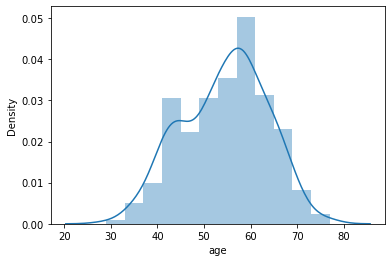

Sex : Sex of the patient

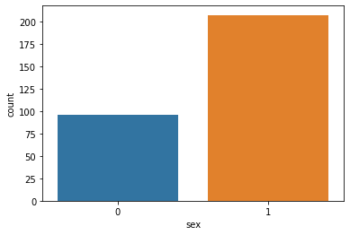

cp : Chest Pain type (Value 0: typical angina, Value 1: atypical angina, Value 2: non-anginal pain, Value 3: asymptomatic)

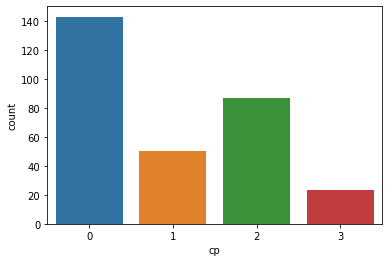

trtbps : resting blood pressure (in mm Hg)

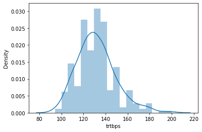

chol: cholesterol in mg/dl fetched via BMI sensor

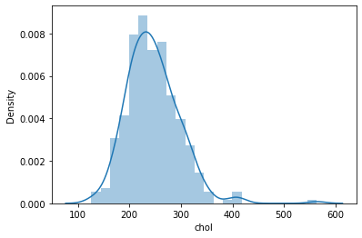

fbs: fasting blood sugar > 120 mg/dl (1 = true ,0 = false)

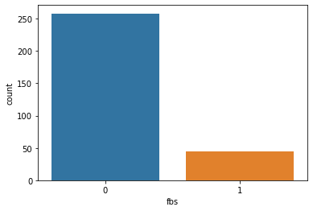

rest_ecg: resting electrocardiographic results (Value 0: normal, Value 1: having ST-T wave abnormality (T wave inversions and/or ST elevation or depression of > 0.05 mV, Value 2: showing probable or definite left ventricular hypertrophy by Estes' criteria)

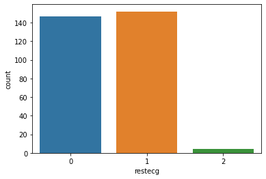

thalach: maximum heart rate achieved

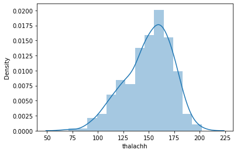

exng: exercise induced angina (1 = yes , 0 = no)

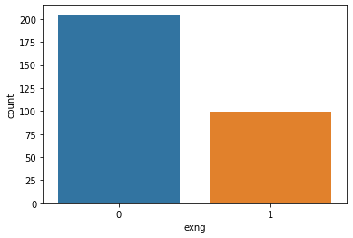

old peak: ST depression induced by exercise relative to rest

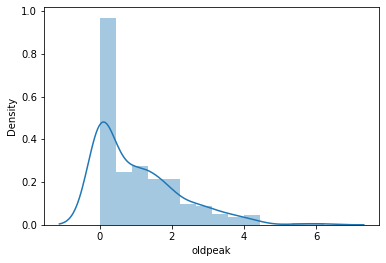

slp: the slope of the peak exercise ST segment (0 = unsloping, 1 = flat, 2 = downsloping)

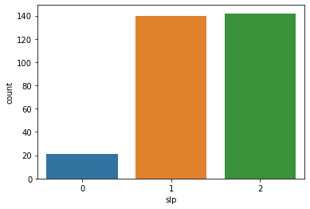

caa: number of major vessels (0-3)

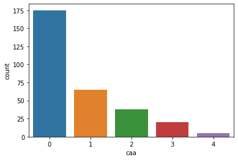

thall : thalassemia (0 = null, 1 = fixed defect, 2 = normal, 3 = reversable defect)

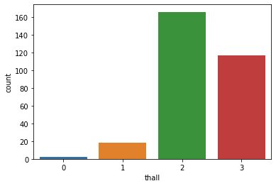

output: diagnosis of heart disease (angiographic disease status)

0: < 50% diameter narrowing. less chance of heart disease
1: > 50% diameter narrowing. more chance of heart disease

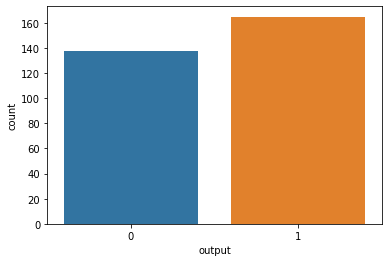

# 3) Data Cleaning
To view the NaN values and Describe the Data, boxplot function is used.
plt.figure(figsize=(10,6))
df.boxplot()
plt.show()

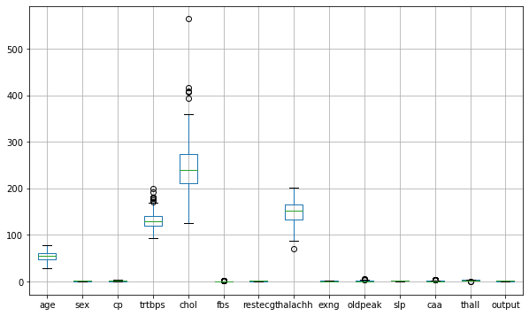

1 duplicated data is found and removed from the datasets

# Step 4) Features Selection

target is chosen from output
cont_column = ['age','trtbps','chol','thalachh','oldpeak']
cat_column = ['sex','cp','fbs','restecg','exng','slp','caa','thall']

Features Selection is made by Logistic Regression(for Continuous data)
and Cramer's V analysis(for categorical data)

Age, trtbps, thalach,chol and oldpeak,cp, thall has the highest correlation of >0.5 
This has been chosen as features dataset.

# Step 5) Data Preprocesing
Data is prepared to train and test using (train_test_split) function

# Step 6) Model Development
Pipeline is created to:
1) Determine whether MMS or SS is better in this case
2) Determine which classifier works the best in this case
    a) Random Forest
     b) Decision Tree
     c) Logistic regression
     d) KNN
     e) SVC

The best pipeline for this cardio dataset is Pipeline(steps=[('MinMaxScaler', MinMaxScaler()),('LogisticClassifier', LogisticRegression())]) with accuracy of 0.8021978021978022
    
 # Step 7) Model Evaluation & Analysis
  1. Confusion Matrix 
   [[34 10]
    [ 8 39]]
    
  2. Classification Report :
  
                precision    recall  f1-score   support

         0.0       0.81      0.77      0.79        44
         1.0       0.80      0.83      0.81        47

    accuracy                           0.80        91
    macro avg       0.80      0.80      0.80        91
    weighted avg       0.80      0.80      0.80        91

# Discussion
1. This model accuracy is 77% which is more than 70%.
2. The best pipeline chosen is 'MinMaxScaler', MinMaxScaler()), ('LogisticClassifier', LogisticRegression())])
3. The dataset shows high correlation between 'age','trtbps','chol','thalachh','oldpeak','cp','thall' vs probability of getting heart attack more than >0.5 score accuracy
4.  The accuracy can be improved by having more data into the training set
5.  Streamlit app is created for user input data from app
